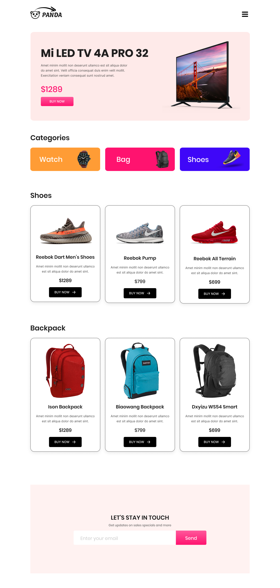

# Goods Panda - Ecommerce Landing Page

## 📌 Project Overview

এই repository তে  design  অনুযায়ী একটি modern , responsive e-commerce  landing page তৈরি করার জন্য প্রয়োজনীয় সব requirements উল্লেখ করা হয়েছে। ল্যান্ডিং পেজে থাকবে— Featured Product, Category, Shoes Section, Backpack Section এবং Newsletter subscription form। 

---

## 🛠️ টেক স্ট্যাক

* **HTML5**, **CSS3**, 

---

## 🎨 ডিজাইন রিকোয়ারমেন্টস

### 1. **Header Section**

* বাম পাশে logo
* ডান পাশে
icon
* যথাযথ ভাবে padding, margin ব্যবহার করবে। 

### 2. **Hero Section – Featured Product**

* Product: *Mi LED TV 4A Pro 32*
* বাম পাশে: শিরোনাম, বর্ণনা, মূল্য,  button
* ডান পাশে: Product image
* হালকা  background 
* যথাযথ ভাবে padding, margin ব্যবহার করবে।

### 3. **Category Section**

Section Title
* Design অনুযায়ী একটা সেকশন **Title** রাখবে।
  
৩টি category card:

* **Watch** – কমলা background
* **Bag** – গোলাপি background
* **Shoes** – নীল background

প্রত্যেক কার্ডে থাকবে:

* icon/image
* টেক্সট label
* রাউন্ডেড কর্নার

কার্ড গুলো Design অনুযায়ী পাশাপাশি সমান সংখ্যক দুরুত্ব নিয়ে অবস্থান করবে। 

### 4. **Shoes Section**

Section Title
* Design অনুযায়ী একটা সেকশন **Title** রাখবে।

৩টি প্রোডাক্ট কার্ড: প্রত্যেক কার্ডে থাকবে:

* Product image
* title
* ছোট বর্ণনা
* মূল্য
* "Buy Now" button
* Card এর ভেতরে content গুলো center-aligned থাকবে।  

### 5. **Backpack Section**

৩টি প্রোডাক্ট কার্ড: ৩টি প্রোডাক্ট কার্ড: প্রত্যেক কার্ডে থাকবে:

* Product image
* title
* ছোট বর্ণনা
* মূল্য
* "Buy Now" button
* Card এর ভেতরে content গুলো center-aligned থাকবে।  

### 6. **Newsletter Section**

* Headline থাকবে: *LET'S STAY IN TOUCH*
* একটা Subtext থাকবে : “Get updates on sales specials and more”
* Email input field এবং "Send" button থাকবে।
* content গুলো center-aligned থাকবে।  

---

## 📱 Responsive Design

320px পর্যন্ত responsive করতে হবে।  

### Laptop Device  (max-width:1200px)

**Hero** 
* Hero Section এর Font প্রয়োজন অনুযায়ী ছোট করে নিবে। 

### Tablet Device (max-width:992px)

**Categories**
* wrap হয়ে থাকবে।  প্রয়োজন অনুযায়ী নিচে চলে যাবে।

**Products**
* কার্ড গুলো নিচে নিচে অবস্থান করবে। 

**Newsletter**
* Input box  প্রয়োজন অনুযায়ী ছোট করে নেবে। 

### Mobile Device (max-width:640px)

**Categories**
* এক কলামে নিচে নিচে  অবস্থান করবে।  সম্পুর্ন width নিয়ে নিবে। 
* ভিতরের কন্টেন্ট গুলো ও এক  কলামে নিচে নিচে  অবস্থান করবে এবং center aligned থাকবে। ।

**Newsletter**
* Input box  এবং বাটন এক  কলামে নিচে নিচে  অবস্থান করবে এবং center aligned থাকবে।

### এর বাইরে প্রয়োজন অনুযায়ী font-size ছোট বড় করে নেবে। 

 

